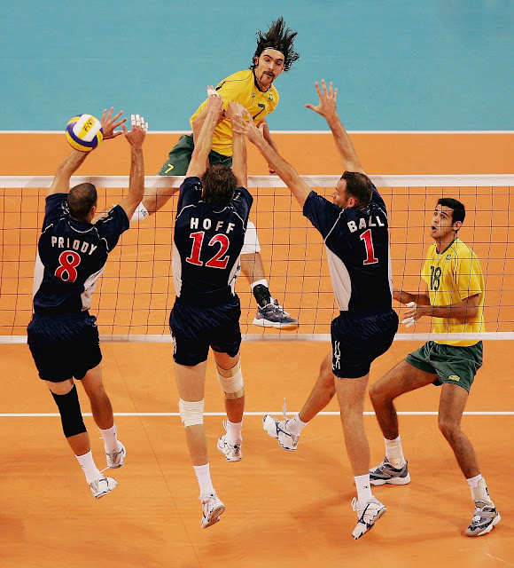

## Voleibol

*Historia*

El voleibol fue inventado en 1895 por [*William G. Morgan*](https://es.wikipedia.org/wiki/William_George_Morgan), un director de educación física en Holyoke, Massachusetts. Morgan creó el juego como una alternativa al baloncesto, que había sido inventado 4 años antes en Springfield, Massachusetts.

Inicialmente llamado **Mintonette**, el juego se jugaba en una cancha de baloncesto, pero con una red de tenis colocada a una altura de 6 pies y 6 pulgadas. El objetivo del juego era pasar la pelota sobre la red de un equipo a otro sin dejarla caer en el suelo. El juego fue renombrado como "voleibol" en 1896.

En 1900, se celebró el primer torneo de voleibol en Springfield, Massachusetts, y más tarde se incluyó en los Juegos Olímpicos de Verano de 1964 en Tokio, Japón.

El voleibol ha evolucionado desde sus humildes comienzos, y hoy es uno de los deportes más populares del mundo. Se juega en todo el mundo en todos los niveles, desde el recreativo hasta los torneos olímpicos.

**Posiciones**
- *Colocador*: es el jugador encargado de dirigir el juego y decidir a qué jugador se le entregará el balón para realizar el ataque. Suele ser el jugador número 1 del equipo y se sitúa en la parte trasera del campo.
- *Opuesto*: este jugador se coloca en la posición contraria al armador, y es quien se encarga de realizar los ataques más potentes y espectaculares. Suele ser el jugador número 2 del equipo.
- *2 Centrales*: estos jugadores se colocan en el centro del campo y son responsables de bloquear los ataques del equipo contrario. Su papel es fundamental en la defensa, y son los jugadores número 5 y 6 del equipo.
- *2 Puntas*: se trata de los jugadores que se colocan en el frente del campo y son los principales atacantes. Suelen ser los jugadores números 3 y 4 del equipo, y sus ataques son fundamentales para lograr puntos en el juego. 

##### **Juego**

El juego de voleibol es un deporte en el que **dos equipos de seis jugadores** se enfrentan en una cancha dividida por una red. El objetivo del juego es enviar la pelota por encima de la red y hacer que caiga en el campo contrario sin que el equipo contrario pueda devolverla. El juego comienza con un saque y luego los equipos tienen tres toques para pasar la pelota al otro lado de la red. Si el balón toca el suelo del equipo contrario, el equipo que lo hizo gana un punto y el juego continúa. El primer equipo en llegar a 25 puntos (con una ventaja de al menos dos puntos) gana el set. Un partido típico consta de tres sets.

Los mejores países en el voleibol varían dependiendo de si se trata de hombres o mujeres, pero algunos de los más destacados son:

HOMBRES:
1- Brasil
2- Estados Unidos
3- Rusia
4- Italia
5- Polonia

MUJERES:
1- China
2- Estados Unidos
3- Brasil
4- Rusia
5- Japón

 [*Video partido de volleyball*](https://www.youtube.com/watch?v=xe7uDlJz8HE)
